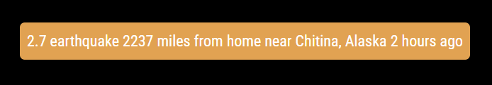

# Module: MMM-EarthquakeAlerts

`MMM-EarthquakeAlerts` is a module for [MagicMirror²](https://github.com/MagicMirrorOrg/MagicMirror). It posts alert messages to your MagicMirror regarding recent earthquakes based on USGS data.



The module is set up to show:
- Quakes of at least 2.5 magnitude within 10 miles,
- Quakes of at least 4.0 magnitude within 60 miles,
- Quakes of at least 5.5 magnitude within 300 miles, and
- Quakes of at least 7.0 magnitude worldwide

This should roughly equate to quakes that can be felt at the given location (plus major worldwide quakes).  I may allow customizing these values through config, but for now that seems to convoluted.

Suggestions are welcome.

## Installation

```bash
cd ~/MagicMirror/modules
git clone https://github.com/dathbe/MMM-EarthquakeAlerts
cd ~/MagicMirror/modules/MMM-EarthquakeAlerts
npm install
```

## Updating

```bash
cd ~/MagicMirror/modules/MMM-EarthquakeAlerts
git pull
npm install
```

## Usage

### Example Config

To use this module, add it to the modules array in your `~/MagicMirror/config/config.js` file:

````js
{
  module: 'MMM-EarthquakeAlerts',
  position: 'top_bar',
  config: {
    locations: [
      {latitude: 39.1, longitude: -94.6, name: 'home'},
      {latitude: 46.2, longitude: 6.13, name: 'mom'},
    ],
  }
}
````
You should list your most important location first because the module looks through the locations in order and returns a result on the first distance/magnitude match.

### Configuration options

The following properties can be configured:

| Option                | Description
|-----------------------|------------
|`locations`       |Technically *optional*, but not very useful without putting in at least one location you are interested in getting alerts on.<br>**Type:** `array` of `dict`s<br>**Default:** `[{ latitude: 39.1, longitude: -94.6, name: 'nowhere specific' }]`
|`updateInterval`  |*Optional* The time between refreshes of quake information in seconds<br>**Type:** `int`<br>**Default:** `30 * 60` (30 minutes)
|`animationSpeed`  |*Optional* The speed of animated transitions from one message to another in milliseconds<br>**Type:** `int`<br>**Default:** `2000` (2 seconds)

## Contributing

If you find any problems, bugs or have questions, please [open a GitHub issue](https://github.com/dathbe/MMM-EarthquakeAlerts/issues) in this repository.

Pull requests are of course also very welcome 🙂

### Code of Conduct

Please note that this project is released with a [Contributor Code of Conduct](CODE_OF_CONDUCT.md). By participating in this project you agree to abide by its terms.

### Developer commands

- `npm run lint` - Run linting checks.
- `npm run lint:fix` - Fix automatically fixable linting errors.

## License

This project is licensed under the MIT License - see the [LICENSE](LICENSE.md) file for details.
